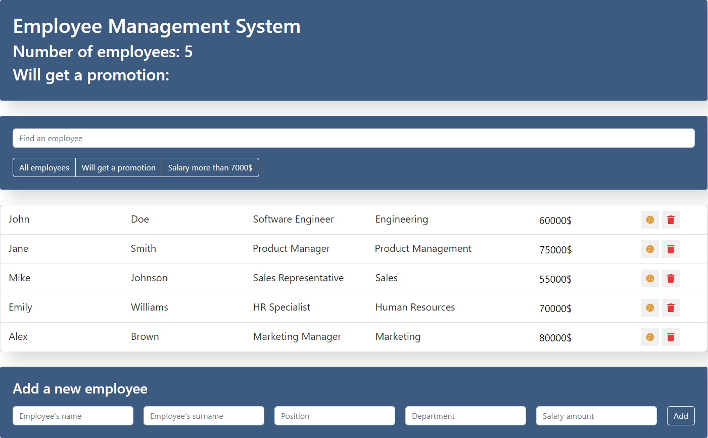

# Simple React Employee Management System

### Update Info:

Project has undergone significant updates. The project now leverages Redux Toolkit and RTK Query for efficient state management and API integration. Additionally, the functionality for employee search and addition has been revamped, incorporating slices and transitioning from class components to functional components.

### Description:

The Simple React Employee Management System is a straightforward web application designed as a basic CRUD (Create, Read, Update, Delete) system. The primary functionality revolves around managing a list of employees, allowing users to perform essential actions such as adding, removing, updating, and filtering employee records.

### Gh-pages:

### Key Features:

- Employee Addition: Users can easily add new employees to the system, providing basic information such as name, position, and contact details.

- Employee Deletion: The application supports the removal of employees from the list, allowing for straightforward management and maintenance of the employee database.

- Employee Promotion: Users have the ability to update employee details, including promotions, to reflect changes in their roles or positions within the organization.

- Employee Display: The system provides a clear and organized display of all employees, showcasing their essential information in a user-friendly format.

- Employee Filtering: Users can filter the list of employees based on specific criteria, streamlining the process of finding and managing relevant records.

### Technologies Used:

- React
- Redux Toolkit for state management
- RTK Query for API integration
- Basic styling with CSS

### How to Run the Project:

1. Clone the repository from GitHub.
1. Navigate to the project directory.
1. Run npm install to install dependencies.
1. Execute npm start to launch the application locally.
1. Open your browser and visit the specified address to experience the Simple React Employee Management System.

### App screenshot:

